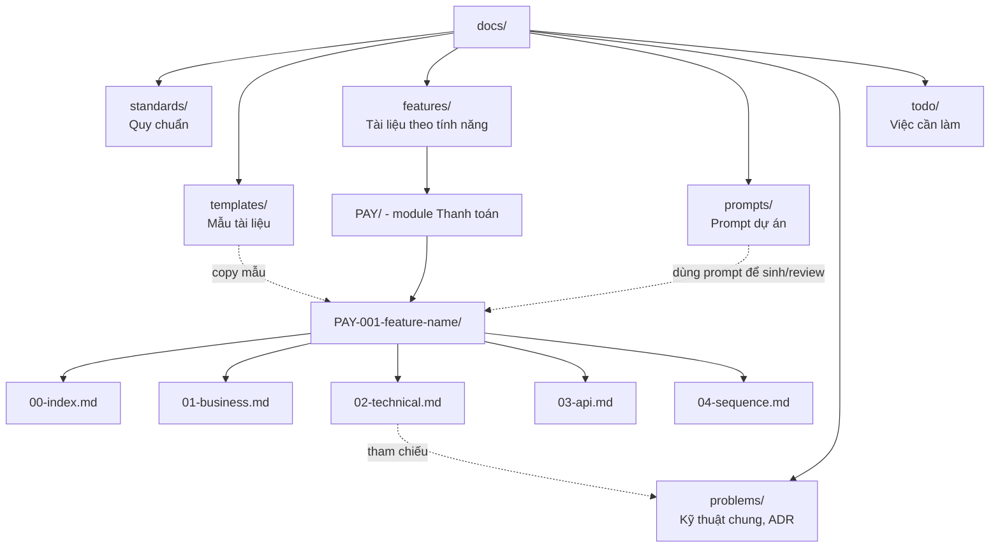

# Hệ thống tài liệu nội bộ

Thư mục này chứa toàn bộ tài liệu của dự án. Đọc file này trước để biết cần tìm gì và tìm ở đâu.

## 1. Tìm tài liệu ở đâu?

| Bạn cần | Vào thư mục | Ghi chú |
|---|---|---|
| Quy chuẩn viết tài liệu | `standards/` | Cấu trúc, mã số, văn phong, sơ đồ, quy trình |
| Mẫu để copy khi viết mới | `templates/` | Mỗi loại tài liệu có 1 mẫu |
| Tài liệu của từng tính năng | `features/` | Tra theo mã tính năng, ví dụ `PAY-001` |
| Tài liệu kỹ thuật dùng chung, quyết định kiến trúc | `problems/` | Tra theo mã `TEC-xxx` hoặc `ADR-xxxx` |
| Định nghĩa từng bài toán AI | `problems/ai-problems/` | Tra theo mã `AIP-xxx`. Xem sơ đồ luồng trong README của thư mục |
| Prompt để nhờ AI viết/review tài liệu | `prompts/` | Mỗi prompt có mã `PRM-xxx` |

## 2. Sơ đồ tổng quan

## 3. Các bước viết một tài liệu mới (tóm tắt)

1. Xác định tài liệu thuộc tính năng (`features/`) hay dùng chung (`problems/`), xem `standards/06-tech-docs.md`.
2. Xác định mã (xem `standards/02-id-conventions.md`). Chưa có thì xin mã mới trong `features/README.md` hoặc `problems/README.md`.
3. Tạo thư mục hoặc file theo `standards/01-folder-structure.md`.
4. Copy template phù hợp từ `templates/` vào thư mục đó.
5. Viết theo `standards/03-writing-style.md`. Cần AI hỗ trợ thì dùng prompt trong `prompts/`.
6. Vẽ sơ đồ theo `standards/04-diagrams.md`.
7. Ghi mục "Tài liệu tham chiếu" theo `standards/07-references.md`.
8. Tự kiểm tra bằng checklist ở `standards/05-doc-workflow.md`, rồi mở merge request.

Khi **sửa** một tài liệu có sẵn: rà luôn các tài liệu trong mục "Tài liệu tham chiếu" của nó, sửa những tài liệu bị ảnh hưởng trong cùng merge request (quy trình ở `standards/07-references.md` mục 4).

## 4. Mục lục quy chuẩn

- [01 - Cấu trúc thư mục](standards/01-folder-structure.md)
- [02 - Quy tắc mã số](standards/02-id-conventions.md)
- [03 - Văn phong](standards/03-writing-style.md)
- [04 - Sơ đồ](standards/04-diagrams.md)
- [05 - Quy trình viết và duyệt](standards/05-doc-workflow.md)
- [06 - Tài liệu kỹ thuật chung](standards/06-tech-docs.md)
- [07 - Tài liệu tham chiếu](standards/07-references.md)
