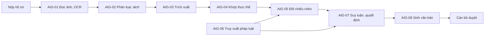

# Bài toán AI của luồng xử lý hồ sơ

Các bài toán AI cần giải trong luồng xử lý hồ sơ, chia hai tầng:

- **Nhóm** `AIG-NN`: một năng lực AI cần có để hoàn thành luồng.
- **Bài toán con** `AIP-NNN`: vấn đề cụ thể trong nhóm, đủ nhỏ để thử nghiệm và theo dõi riêng. Mã đánh số chung, không theo nhóm.

Mỗi nhóm, mỗi bài toán con là một file trong thư mục này. Đây là nơi **duy nhất** cấp mã `AIG` và `AIP`. Quy chuẩn chung xem [06 - Tài liệu kỹ thuật chung](../../standards/06-tech-docs.md). Chỗ ghi `[CẦN XÁC NHẬN]` cần bổ sung khi đi sâu vào bài toán.

## 1. Sơ đồ luồng

Các nhóm áp dụng cho mọi bước (không vẽ trong sơ đồ): AIG-09 đánh giá chất lượng, AIG-10 an toàn và bảo mật, AIG-11 học từ phản hồi, AIG-12 vận hành model, AIG-13 toàn vẹn giấy tờ.

## 2. Mức ưu tiên

### 2.1. Thang ưu tiên

Mỗi `AIP` có `priority` theo MoSCoW. Nhóm `AIG` không có mức riêng: nhóm xong khi các bài toán `Must` của nó xong.

| Mức | Ý nghĩa | Số bài toán |
|---|---|---|
| `Must` | Bắt buộc trước khi chạy thật. Làm trước | 23 |
| `Should` | Làm sau `Must`, hoặc khi số liệu cho thấy cần | 11 |
| `Could` | Chỉ làm khi còn nguồn lực | 3 |

Bài toán là `Must` khi thỏa ít nhất một tiêu chí: **A1** thiếu thì luồng không chạy được; **A2** thiếu thì có thể quyết định sai mà không ai phát hiện; **A3** ràng buộc pháp lý hoặc bảo mật; **A4** cần để đo các bài toán `Must` khác.

> `[CẦN XÁC NHẬN]` Danh sách `Must` giả định bản đầu tiên tự đề xuất quyết định. Nếu bản đầu chỉ đọc và trích xuất, giai đoạn 4 và 5 dưới đây có thể hạ xuống `Should`.

### 2.2. Thứ tự xử lý bài toán Must

Giai đoạn sau dùng kết quả giai đoạn trước. Trong mỗi giai đoạn, bài toán xếp theo thứ tự nên làm.

| Giai đoạn | Bài toán |
|---|---|
| 0 - Nền tảng | AIP-026, AIP-034 |
| 1 - Đọc và trích xuất | AIP-001, 002, 004, 005, 006, 029 |
| 2 - Đối chiếu | AIP-007, 011, 010, 012 |
| 3 - Truy xuất pháp luật | AIP-014, 016, 015, 018 |
| 4 - Ra quyết định | AIP-019, 020, 021 |
| 5 - Sinh văn bản và nghiệm thu | AIP-023, 024, 025, 027 |

### 2.3. Thử nghiệm sớm

Ba bài toán khó nhất, quyết định hướng thiết kế cả luồng (`early_test: true`). Chạy thử ngay từ giai đoạn 0, song song với golden set, không chờ tới giai đoạn của chúng:

1. OCR chữ viết tay và hiệu chỉnh độ tin cậy: AIP-001, AIP-002.
2. Phân biệt mâu thuẫn thật với lỗi OCR/trích xuất: AIP-010.
3. Truy xuất theo hiệu lực thời gian và abstention: AIP-015, AIP-020.

## 3. Danh sách nhóm và bài toán

### 3.1. Loại bài toán con

Trường `kind` trong file `AIP`:

| `kind` | Cột "Loại" | Ý nghĩa |
|---|---|---|
| `problem` | Bài toán | Tạo đầu ra trực tiếp của luồng |
| `method` | Phương pháp | Một cách giải bài toán khác, thay được mà luồng không đổi. Không có giá trị riêng thì gộp vào bài toán nó phục vụ |
| `concern` | Rủi ro | Rủi ro an toàn, bảo mật, pháp lý, chất lượng cần kiểm soát ở nhiều bước |
| `enabler` | Hỗ trợ | Năng lực để đo, vận hành, cải tiến bài toán khác |

### 3.2. Danh sách

Mọi bài toán hiện ở trạng thái `Draft`, giai đoạn `Defined`. Sớm = thử nghiệm sớm.

| Nhóm | Mã | Bài toán | Loại | Ưu tiên | Sớm |
|---|---|---|---|---|---|
| [AIG-01 Đọc ảnh và OCR](AIG-01-document-vision-ocr.md) | [AIP-001](AIP-001-document-ocr.md) | Đọc bố cục và chữ tiếng Việt trên giấy tờ | Bài toán | Must | Có |
| | [AIP-002](AIP-002-ocr-confidence-calibration.md) | Hiệu chỉnh độ tin cậy theo từng trường | Bài toán | Must | Có |
| | [AIP-003](AIP-003-image-quality-check.md) | Đánh giá chất lượng ảnh | Bài toán | Should | |
| [AIG-02 Phân loại và tách](AIG-02-classification-splitting.md) | [AIP-004](AIP-004-document-classification-splitting.md) | Phân loại và tách giấy tờ | Bài toán | Must | |
| [AIG-03 Trích xuất](AIG-03-information-extraction.md) | [AIP-005](AIP-005-schema-extraction.md) | Trích xuất theo schema và sửa lỗi OCR | Bài toán | Must | |
| | [AIP-006](AIP-006-extraction-grounding.md) | Grounding và chống bịa khi trích xuất | Bài toán | Must | |
| [AIG-04 Khớp thực thể](AIG-04-entity-resolution.md) | [AIP-007](AIP-007-person-matching.md) | Khớp cùng một người qua nhiều giấy tờ | Bài toán | Must | |
| | [AIP-008](AIP-008-address-normalization.md) | Chuẩn hóa địa chỉ hành chính Việt Nam | Bài toán | Should | |
| | [AIP-009](AIP-009-household-inference.md) | Suy ra quan hệ hộ | Bài toán | Should | |
| [AIG-05 Đối chiếu chéo](AIG-05-cross-document-validation.md) | [AIP-010](AIP-010-conflict-vs-error.md) | Phân biệt mâu thuẫn thật với lỗi OCR/trích xuất | Bài toán | Must | Có |
| | [AIP-011](AIP-011-temporal-numeric-reasoning.md) | Suy luận thời gian và số học | Phương pháp | Must | |
| | [AIP-012](AIP-012-missing-document-detection.md) | Phát hiện thiếu giấy tờ | Bài toán | Must | |
| | [AIP-013](AIP-013-uncertainty-propagation.md) | Ước lượng độ bất định lan truyền | Phương pháp | Should | |
| [AIG-06 Truy xuất pháp luật](AIG-06-legal-retrieval.md) | [AIP-014](AIP-014-legal-retrieval.md) | Truy xuất điều khoản pháp luật tiếng Việt | Bài toán | Must | |
| | [AIP-015](AIP-015-temporal-validity-retrieval.md) | Truy xuất theo hiệu lực thời gian | Bài toán | Must | Có |
| | [AIP-016](AIP-016-legal-document-relations.md) | Quan hệ giữa văn bản pháp luật | Bài toán | Must | |
| | [AIP-017](AIP-017-legal-conflict-resolution.md) | Giải quyết xung đột giữa văn bản | Bài toán | Should | |
| | [AIP-018](AIP-018-retrieval-evaluation.md) | Đánh giá retrieval | Hỗ trợ | Must | |
| [AIG-07 Suy luận, quyết định](AIG-07-legal-decision.md) | [AIP-019](AIP-019-legal-reasoning.md) | Suy luận pháp lý | Bài toán | Must | |
| | [AIP-020](AIP-020-three-way-decision-abstention.md) | Quyết định ba lớp, abstention, ngưỡng theo chi phí lỗi | Bài toán | Must | Có |
| | [AIP-021](AIP-021-explainability-faithfulness.md) | Giải thích và faithfulness | Bài toán | Must | |
| | [AIP-022](AIP-022-decision-consistency.md) | Nhất quán kết quả | Rủi ro | Should | |
| [AIG-08 Sinh văn bản](AIG-08-legal-generation.md) | [AIP-023](AIP-023-controlled-generation.md) | Sinh văn bản kết quả có kiểm soát | Bài toán | Must | |
| | [AIP-024](AIP-024-citation-grounding.md) | Grounding trích dẫn pháp lý | Bài toán | Must | |
| | [AIP-025](AIP-025-post-generation-verification.md) | Kiểm chứng sau sinh | Bài toán | Must | |
| [AIG-09 Đánh giá chất lượng](AIG-09-evaluation-qa.md) | [AIP-026](AIP-026-layered-golden-set.md) | Golden set và metric theo từng tầng | Hỗ trợ | Must | |
| | [AIP-027](AIP-027-end-to-end-evaluation.md) | Đánh giá end-to-end và chấm văn bản sinh ra | Hỗ trợ | Must | |
| | [AIP-028](AIP-028-regression-testing.md) | Regression test khi đổi model, prompt, luật | Hỗ trợ | Should | |
| [AIG-10 An toàn, bảo mật](AIG-10-safety-security.md) | [AIP-029](AIP-029-document-prompt-injection.md) | Chống prompt injection từ nội dung tài liệu | Rủi ro | Must | |
| | [AIP-030](AIP-030-bias-fairness.md) | Bias và fairness | Rủi ro | Should | |
| | [AIP-031](AIP-031-red-teaming.md) | Red-teaming | Hỗ trợ | Should | |
| [AIG-11 Học từ phản hồi](AIG-11-feedback-learning.md) | [AIP-032](AIP-032-reviewer-feedback-learning.md) | Học từ chỉnh sửa của cán bộ duyệt | Hỗ trợ | Should | |
| | [AIP-033](AIP-033-review-sample-selection.md) | Chọn hồ sơ cần người duyệt | Bài toán | Could | |
| [AIG-12 Vận hành model](AIG-12-model-operations.md) | [AIP-034](AIP-034-data-privacy-hosting.md) | Model nội bộ hay API ngoài, bảo vệ dữ liệu cá nhân | Rủi ro | Must | |
| | [AIP-035](AIP-035-model-serving-cost-latency.md) | Phân tầng model, tối ưu chi phí và độ trễ | Hỗ trợ | Should | |
| | [AIP-036](AIP-036-drift-detection.md) | Drift detection | Hỗ trợ | Could | |
| [AIG-13 Toàn vẹn giấy tờ](AIG-13-document-integrity.md) | [AIP-037](AIP-037-tampering-detection.md) | Phát hiện giả mạo, chỉnh sửa ảnh | Rủi ro | Could | |

## 4. Giai đoạn nghiên cứu

Ngoài `status`, mỗi `AIP` có `stage`. Đổi `stage` thì cập nhật bảng ở mục 3.2.

| `stage` | Cần có trong tài liệu |
|---|---|
| `Defined` | Mục 1, 2, 3 đầy đủ |
| `Exploring` | Mục 4.1 có các hướng đã khảo sát, mục 4.3 có nhật ký thử nghiệm |
| `Decided` | Hướng được chọn và lý do; quyết định lớn ghi ADR trong `../adr/` |
| `In production` | Trỏ tới tài liệu `TEC` hoặc tài liệu kỹ thuật của tính năng |

## 5. Thêm, sửa bài toán

**Thêm bài toán con:** nếu chỉ là một cách làm (`method`) cho bài toán có sẵn thì ghi vào "Hướng tiếp cận" của bài toán đó. Nếu không: lấy mã `AIP` lớn nhất ở mục 3.2 cộng 1, thêm dòng vào mục 3.2 và file `AIG`, xếp ưu tiên theo mục 2 (Must thì thêm vào mục 2.2), copy `templates/TPL-AIP-problem.md` thành `AIP-<NNN>-<short-name>.md`, ghi tham chiếu hai phía theo `standards/07-references.md`.

**Thêm nhóm:** hiếm khi cần. Lấy mã `AIG` tiếp theo, copy `templates/TPL-AIG-group.md`, thêm vào mục 1 và 3.2.

**Chuyển nhóm:** đổi `group` trong file `AIP` và dòng trong bảng; không đổi mã.

**Gộp A vào B:** chuyển nội dung sang B, đổi ràng buộc `A-R<NN>` sang mã của B, đặt A `Deprecated` kèm `replaced_by: B` (không xóa file), ghi "Lịch sử thay đổi" ở cả hai, rà các tài liệu "Được dùng bởi" của A.

**Đi sâu vào bài toán:** chọn theo thứ tự mục 2.2 hoặc 2.3; đổi `stage` sang `Exploring`, điền `owner`; thay các chỗ `[CẦN XÁC NHẬN]`; chốt ngưỡng chấp nhận trước khi thử nghiệm; ghi mọi thử nghiệm (kể cả thất bại) vào mục 4.3; đổi đầu vào/đầu ra thì rà chiều "Được dùng bởi". File vượt ~300 dòng thì tách thư mục con theo `standards/01-folder-structure.md`.
