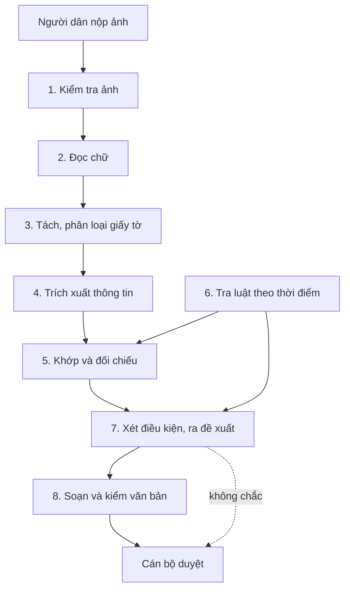

# Luồng giải pháp xử lý hồ sơ đất đai - Đề xuất

Tài liệu này đề xuất một luồng giải pháp đầy đủ cho bài toán mô tả ở [Giải thích cho người mới](../problems/ai-problems/00-overview.md). Luồng đi từ lúc người dân nộp ảnh tới lúc cán bộ duyệt.

Cách đọc nhãn trong tài liệu:

- Phần có mã `AIP` lấy từ tài liệu bài toán đã có.
- Phần ghi **(đề xuất)** là hướng làm mới, chưa thử nghiệm, cần nhóm xem lại trước khi chốt.

## 1. Năm nguyên tắc thiết kế

1. **Một "hồ sơ số" dùng chung.** Mỗi bước đọc hồ sơ số, rồi ghi thêm kết quả của mình vào. Mỗi thông tin luôn kèm nguồn (trang, vùng ảnh hoặc điều luật) và điểm tin cậy. Nhờ vậy, bước nào cũng truy ngược được về ảnh gốc (AIP-006-R01).
2. **Code làm phần chắc chắn, AI làm phần cần đọc hiểu.** Tính ngày, cộng diện tích, đếm giấy tờ đều do code làm. AI chỉ đọc chữ, hiểu văn bản tự do và diễn giải điều luật (AIP-011-R01, AIP-019-R01).
3. **Mỗi bước có một cổng kiểm tra.** Nếu một bước không đạt, hồ sơ được chuyển cán bộ ngay kèm lý do cụ thể, không đi tiếp với dữ liệu sai (AIP-020-R02).
4. **Model nhỏ trước, model mạnh sau.** Việc dễ dùng model nhỏ. Khi độ tin cậy thấp, hệ thống chạy lại bằng model mạnh hơn (AIP-035).
5. **Dữ liệu cá nhân ở lại nội bộ.** Các bước đọc ảnh chạy trên model tự host. Nếu cần gửi ra API ngoài, hệ thống thay họ tên, số CCCD bằng mã trước khi gửi (AIP-034).

## 2. Sơ đồ luồng

**Luồng xử lý một hồ sơ đất đai**



| Bước | Ai làm | Việc gì | Vì sao |
|---|---|---|---|
| 1 | Hệ thống | Kiểm tra ảnh đủ rõ để đọc | Ảnh kém thì yêu cầu chụp lại ngay, đỡ mất công các bước sau |
| 2 | Hệ thống | Đọc chữ kèm vị trí và điểm tin cậy | Mọi bước sau dựa vào chữ đọc được |
| 3 | Hệ thống | Tách file thành từng giấy tờ, nhận loại giấy | Mỗi loại giấy có danh sách trường cần lấy riêng |
| 4 | Hệ thống | Lấy các trường cần thiết theo mẫu của loại giấy | Biến ảnh thành dữ liệu có cấu trúc |
| 5 | Hệ thống | Nhận ra cùng một người, so thông tin giữa các giấy, tìm giấy còn thiếu | Phát hiện mâu thuẫn và thiếu sót |
| 6 | Hệ thống | Lấy điều luật có hiệu lực tại thời điểm phát sinh hồ sơ | Chạy song song, cung cấp danh sách giấy tờ bắt buộc và điều kiện |
| 7 | Hệ thống | Xét từng điều kiện rồi đề xuất kết quả | Nếu không chắc, chuyển cán bộ ngay |
| 8 | Hệ thống | Soạn văn bản theo mẫu, kiểm lại mọi số liệu và trích dẫn | Chặn thông tin sai trước khi tới tay cán bộ |
| 9 | Cán bộ | Duyệt, sửa, ký | Quyết định cuối cùng luôn do cán bộ đưa ra |

## 3. Chi tiết từng bước

### 3.1. Kiểm tra ảnh (AIP-003)

- **Cách làm:** đo độ mờ, độ sáng, độ nghiêng và xem ảnh có bị cắt mất góc không. Ảnh nghiêng thì hệ thống tự xoay và làm phẳng.
- **Chuyển đi đâu:** ảnh quá kém thì báo người dân chụp lại ngay trên cổng nộp **(đề xuất)**, không để tới lúc cán bộ phát hiện.

### 3.2. Đọc chữ (AIP-001, AIP-002)

- **Tách vùng:** chia trang thành các vùng chữ in, chữ viết tay, dấu mộc, chữ ký, bảng, sơ đồ thửa đất.
- **Đọc chữ in:** dùng OCR chuyên dụng. Nhóm đang so PaddleOCR, VietOCR và Tesseract trong `jupyters/ocr-eval.ipynb`.
- **Đọc chữ viết tay và vùng khó:** vùng có điểm thấp được đọc lại bằng VLM (model đọc được cả ảnh và chữ). Đây là hướng "kết hợp OCR chuyên dụng và VLM" trong AIP-001.
- **Hiệu chỉnh điểm tin cậy:** dùng golden set để chỉnh điểm thô của model. Sau khi chỉnh, "0,9" phải nghĩa là đúng khoảng 90% số lần **(đề xuất:** hiệu chỉnh riêng theo loại chữ in hay viết tay và theo loại trường).
- **Kết quả:** chữ, vị trí trên ảnh, điểm tin cậy đã hiệu chỉnh.

### 3.3. Tách và phân loại giấy tờ (AIP-004)

- **Cách làm:** phân loại từng trang, rồi gom các trang liền nhau cùng loại thành một giấy tờ. Giấy có mẫu cố định (CCCD, sổ đỏ) nhận theo tiêu đề và bố cục. Giấy không có mẫu (giấy sang đất) giao cho model phân loại **(đề xuất)**.
- **Kết quả:** danh sách giấy tờ, mỗi giấy gồm các trang nào, thuộc loại gì, điểm tin cậy.

### 3.4. Trích xuất thông tin (AIP-005, AIP-006, AIP-029)

- **Cách làm:** mỗi loại giấy có một mẫu JSON riêng, ví dụ sổ đỏ có chủ sử dụng, số thửa, tờ bản đồ, diện tích, địa chỉ. Giấy có mẫu cố định dùng model nhỏ. Giấy sang đất viết tay dùng model nhỏ trước; nếu độ tin cậy dưới 0,7 thì chạy lại bằng model mạnh (ví dụ trong AIP-035).
- **Kiểm tra nguồn:** code dò lại xem giá trị có thật trên ảnh ở vị trí model khai báo không. Không tìm thấy thì đánh dấu "chưa kiểm chứng". Trường không có trên giấy thì để `null`, không đoán (AIP-005-R02, AIP-006-R02).
- **Chống "ra lệnh" qua giấy tờ:** chữ đọc được từ giấy tờ chỉ được đưa vào model như dữ liệu, không bao giờ là chỉ dẫn (AIP-029-R01).

### 3.5. Khớp và đối chiếu (AIP-007 đến AIP-013)

- **Chuẩn hóa:** đưa ngày tháng về một dạng. Đưa địa chỉ về danh mục đơn vị hành chính bằng so khớp gần đúng (AIP-008). Tên được so cả bản có dấu và bản bỏ dấu.
- **Khớp người:** khớp theo số CCCD trước. Không có số thì khớp theo họ tên cộng ngày sinh **(đề xuất)**. Quan hệ hộ (vợ, chồng, con) lấy từ sổ hộ khẩu và giấy chứng tử (AIP-009).
- **Tính toán bằng code:** ví dụ tổng diện tích các thửa `98,5 + 45,0 = 143,5 m²` phải khớp với bản vẽ hiện trạng trong sai số cho phép (AIP-011).
- **Khi hai giấy ghi khác nhau (AIP-010):** hệ thống xét ba dấu hiệu.
  1. Điểm tin cậy của hai giá trị.
  2. Hai ký tự lệch nhau có hay bị nhầm không, ví dụ `3` và `8`, `1` và `7`.
  3. Kết quả đọc lại vùng đó bằng model thứ hai **(đề xuất)**.

  Sau đó hệ thống kết luận là "mâu thuẫn thật", "lỗi đọc" hoặc "chưa chắc", kèm hai vùng ảnh để cán bộ xem.
- **Thiếu giấy tờ (AIP-012):** so danh sách giấy đã nộp với danh sách bắt buộc của thủ tục, lấy từ bước tra luật.
- **Độ bất định (AIP-013):** mỗi kết luận nhận điểm tin cậy thấp nhất trong các trường nó dựa vào **(đề xuất:** cách đơn giản cho bản đầu, thay bằng cách tốt hơn khi có số liệu).

### 3.6. Tra luật theo thời điểm (AIP-014 đến AIP-018)

- **Chuẩn bị kho luật một lần:**
  - Cắt văn bản theo điều, khoản, điểm.
  - Gắn ngày hiệu lực, ngày hết hiệu lực cho từng điều.
  - Ghi quan hệ sửa đổi, thay thế giữa các văn bản (AIP-016).
- **Tìm kiếm:** kết hợp tìm theo từ khóa và tìm theo nghĩa, rồi xếp hạng lại (AIP-014). Sau đó chỉ giữ phiên bản có hiệu lực vào thời điểm phát sinh hồ sơ (AIP-015-R01).
- **Bảng điều kiện theo thủ tục (đề xuất):** với mỗi thủ tục đất đai, chuyên viên pháp lý lập sẵn một bảng gồm giấy tờ bắt buộc, danh sách điều kiện và điều luật căn cứ. Mỗi dòng trong bảng có mốc hiệu lực. Bước tra luật dùng bảng này làm nguồn chính; tìm kiếm tự động chỉ để bổ sung và phát hiện luật mới thay đổi. Cách này chính xác hơn và dễ kiểm tra hơn là để máy tự tìm hoàn toàn.

### 3.7. Xét điều kiện và ra đề xuất (AIP-019 đến AIP-022)

- **Chia điều kiện làm hai loại (AIP-019):**
  - **Code xét:** đủ giấy tờ, diện tích khớp, đúng thời hạn, đúng người đứng tên.
  - **AI xét:** các điều kiện cần đọc hiểu văn bản, ví dụ "đất không có tranh chấp" dựa vào văn bản xác nhận của UBND xã.
- **Kết luận từng điều kiện:** đạt, không đạt hoặc chưa rõ. Mỗi kết luận kèm dẫn chứng tới vùng ảnh hoặc điều luật (AIP-021-R01).
- **Quy tắc gộp thành đề xuất (đề xuất cho bản đầu):**

| Tình huống | Đề xuất |
|---|---|
| Có điều kiện "chưa rõ", hoặc có thông tin quan trọng tin cậy thấp | Chuyển cán bộ, kèm lý do |
| Thiếu giấy tờ bắt buộc, các điều kiện khác đạt | Cần bổ sung, kèm danh sách giấy thiếu |
| Có điều kiện "không đạt" với độ tin cậy cao | Từ chối, kèm căn cứ. Bản đầu vẫn bắt cán bộ xem kỹ mọi đề xuất từ chối |
| Mọi điều kiện đạt với độ tin cậy cao | Chấp thuận |

- **Ngưỡng:** bản đầu đặt tay theo hướng thận trọng. Khi đã có số liệu thì chỉnh theo chi phí lỗi (AIP-020-R03).
- **Nhất quán:** cùng hồ sơ, cùng phiên bản thì phải ra cùng kết quả (AIP-022-R01). Hệ thống cố định cấu hình model và lưu lại phiên bản model, prompt, luật đã dùng.

### 3.8. Soạn và kiểm văn bản (AIP-023 đến AIP-025)

- **Soạn:** dùng mẫu văn bản cố định. AI chỉ điền phần thay đổi như lý do, danh sách giấy cần bổ sung (AIP-023-R01).
- **Trích dẫn:** chỉ lấy điều luật từ kết quả bước tra luật, không tự sinh số điều (AIP-024-R01).
- **Kiểm tra:** code so từng tên, số thửa, diện tích, ngày tháng trong văn bản với hồ sơ số. Ví dụ, văn bản ghi "thửa 126" trong khi dữ liệu là `125` thì bị chặn (AIP-025).
- **Khi sai:** soạn lại một lần. Nếu vẫn sai thì chuyển cán bộ **(đề xuất)**.

### 3.9. Cán bộ duyệt (AIP-032)

- **Màn hình duyệt (đề xuất):** hiện đề xuất, kết luận từng điều kiện và vùng ảnh gốc của từng thông tin, để cán bộ kiểm tra nhanh.
- **Ghi lại chỉnh sửa:** mọi chỗ cán bộ sửa được lưu lại, làm dữ liệu cải tiến cho các bước trên (AIP-032).

## 4. Hồ sơ số: dữ liệu dùng chung giữa các bước

Mỗi thông tin trong hồ sơ số có dạng như sau **(đề xuất)**:

```json
{
  "truong": "so_thua",
  "gia_tri": "125",
  "giay_to": "so_do_1",
  "nguon": { "trang": 2, "vung": [412, 880, 468, 905], "chu_goc": "Thửa số: 125" },
  "diem_tin_cay": 0.93,
  "trang_thai": "da_kiem_chung",
  "buoc_tao": "trich_xuat",
  "phien_ban_model": "<ghi khi chạy>"
}
```

Các bước sau đọc và ghi thêm vào hồ sơ số:

- Kết quả khớp người.
- Các mâu thuẫn tìm được.
- Điều luật đã dùng.
- Kết luận từng điều kiện.
- Đề xuất cuối cùng.

Nhờ vậy, khi hồ sơ bị xử lý sai, nhóm truy được lỗi bắt đầu từ bước nào (AIP-027).

## 5. Các phần chạy song song với luồng

| Việc | Cách làm đề xuất | Bài toán |
|---|---|---|
| Bộ hồ sơ mẫu có đáp án | Sinh dữ liệu tổng hợp bằng `src/data-golden-set-generator`, bổ sung hồ sơ thật đã che thông tin. Gán nhãn cho từng bước | AIP-026 |
| Đo toàn luồng | Chạy cả bộ hồ sơ mẫu, so đề xuất với chuyên viên. Khi sai, truy xem bước nào gây ra | AIP-027 |
| Kiểm tra khi đổi model, prompt, luật | Chạy lại bộ hồ sơ mẫu trước khi đưa bản mới vào chạy thật | AIP-028 |
| Bảo vệ dữ liệu cá nhân | Model tự host cho các bước đọc ảnh. Thay thông tin cá nhân bằng mã khi gửi ra ngoài | AIP-034 |
| Chống "ra lệnh" qua giấy tờ | Tách rõ dữ liệu và chỉ dẫn trong prompt. Thử tấn công định kỳ | AIP-029, AIP-031 |
| Công bằng | So tỉ lệ từ chối, tỉ lệ chuyển cán bộ giữa các nhóm người dân | AIP-030 |
| Chi phí, tốc độ | Model nhỏ trước, model mạnh khi cần. Lưu kết quả để không chạy lại | AIP-035 |
| Chọn hồ sơ cho người xem | Ưu tiên hồ sơ có điểm tin cậy thấp và hồ sơ bị đề xuất từ chối | AIP-033 |
| Theo dõi thay đổi | Cảnh báo khi loại giấy tờ mới xuất hiện nhiều, hoặc khi có luật mới | AIP-036 |

## 6. Lộ trình đề xuất

Mỗi bản chỉ bật thêm quyền tự động khi số liệu của bản trước đạt ngưỡng. README của `ai-problems` cũng gợi ý bản đầu có thể chỉ đọc và trích xuất.

| Bản | Hệ thống làm gì | Cán bộ làm gì | Bài toán cần xong |
|---|---|---|---|
| 0 - Nền tảng | Có bộ hồ sơ mẫu, chốt cách chạy model và bảo vệ dữ liệu. Thử sớm ba phần khó nhất | - | AIP-026, AIP-034; thử sớm AIP-001, 002, 010, 015, 020 |
| 1 - Đọc giúp | Đọc, tách, trích xuất, điền sẵn thông tin kèm vùng ảnh nguồn | Kiểm tra thông tin, tự quyết định | AIP-001 đến 006, 029 |
| 2 - Soát giúp | Thêm khớp người, đối chiếu, báo mâu thuẫn và giấy tờ thiếu | Tự quyết định, dựa trên danh sách vấn đề máy báo | AIP-007, 010, 011, 012 |
| 3 - Đề xuất | Thêm tra luật, xét điều kiện, đề xuất kết quả hoặc chuyển người | Duyệt đề xuất | AIP-014 đến 016, 018 đến 021 |
| 4 - Soạn thảo | Thêm soạn văn bản trả lời đã kiểm tra | Duyệt và ký | AIP-023 đến 025, 027 |

## 7. Điểm cần chốt

| Câu hỏi | Ảnh hưởng tới |
|---|---|
| Hệ thống hỗ trợ những thủ tục đất đai nào trước? | Bảng điều kiện theo thủ tục, danh sách giấy tờ, bộ hồ sơ mẫu |
| Quy định dữ liệu cá nhân nào áp dụng, có được gửi ra API ngoài không? | Chọn model cho mọi bước |
| Tỉ lệ chuyển cán bộ bao nhiêu thì chấp nhận được? | Ngưỡng ở bước 3.7 |
| Với thủ tục này, từ chối oan hay chấp thuận sai đắt hơn? | Ngưỡng ở bước 3.7 |
| Thời điểm phát sinh hồ sơ tính theo mốc nào? | Bước tra luật |
| Ai lập và cập nhật bảng điều kiện theo thủ tục khi luật đổi? | Bước tra luật và xét điều kiện |
| Dùng rule engine có sẵn hay tự viết? | Bước xét điều kiện |

## 8. Tài liệu tham chiếu

| Mã | Tài liệu | Chiều | Nội dung liên quan |
|---|---|---|---|
| - | [Giải thích cho người mới](../problems/ai-problems/00-overview.md) | Dựa vào | Bài toán mà luồng giải pháp này giải |
| - | [README bài toán AI](../problems/ai-problems/README.md) | Dựa vào | Mục 2.2 thứ tự giai đoạn, mục 2.3 thử nghiệm sớm |
| `AIP-001` đến `AIP-036` | [Thư mục ai-problems](../problems/ai-problems/) | Dựa vào | Ràng buộc `AIP-NNN-RNN` và hướng tiếp cận ở mục 4.1 của từng bài |

## 9. Lịch sử thay đổi

| Ngày | Người sửa | Nội dung | Đã rà tham chiếu |
|---|---|---|---|
| 2026-09-30 | binhnguyenSoftz | Tạo mới | Không cần |
