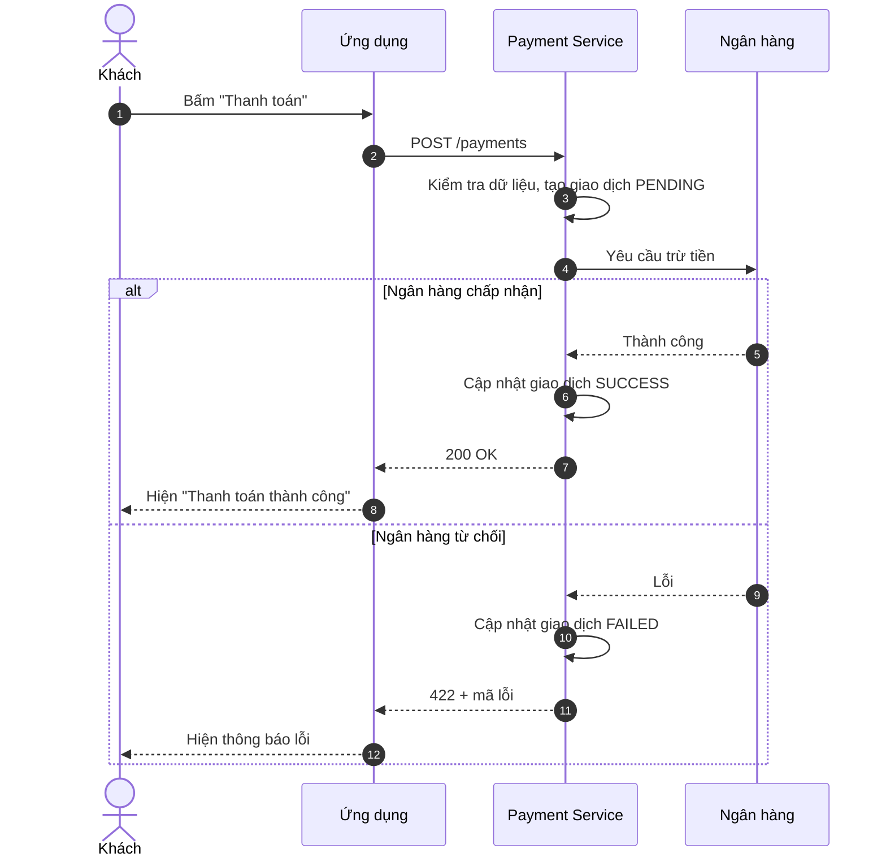
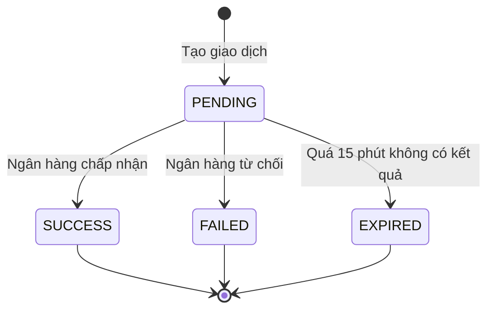

# 04 - Sơ đồ

Dùng **Mermaid** viết ngay trong file `.md`. Ưu điểm: sửa được bằng text, xem được diff, GitLab/GitHub tự hiển thị.

## 1. Chọn loại sơ đồ

| Muốn thể hiện | Dùng | Bắt buộc ở tài liệu nào |
|---|---|---|
| Bức tranh tổng quan, các thành phần liên quan | `flowchart` | `00-index.md`, tài liệu `TEC` nhóm `architecture/` |
| Trình tự trao đổi giữa các bên theo thời gian | `sequenceDiagram` | `04-sequence.md` |
| Vòng đời trạng thái (PENDING, SUCCESS...) | `stateDiagram-v2` | Kỹ thuật, nếu có trạng thái |
| Quan hệ bảng dữ liệu | `erDiagram` | Kỹ thuật, nếu có bảng mới |

## 2. Quy tắc chung

1. Mỗi sơ đồ có **tiêu đề** (dòng văn bản phía trên) và **đoạn diễn giải** ngay bên dưới.
2. Một sơ đồ tối đa khoảng 10 đối tượng tham gia hoặc 15 bước. Nhiều hơn thì tách.
3. Tên đối tượng ngắn và giống tên dùng trong văn bản.
4. Đánh số bước bằng `autonumber` để văn bản nhắc lại được ("ở bước 5").
5. Vẽ luồng thành công trước. Luồng lỗi và ngoại lệ vẽ ở sơ đồ riêng hoặc dùng `alt`.
6. Sơ đồ không thay cho văn bản. Người đọc không xem được hình vẫn phải hiểu được qua phần diễn giải.

## 3. Mẫu sequence chuẩn

Luồng: khách thanh toán, hệ thống gọi ngân hàng.

**Diễn giải theo bước:**

| Bước | Ai làm | Việc gì | Vì sao |
|---|---|---|---|
| 1-2 | Khách, ứng dụng | Khách bấm nút, ứng dụng gọi API | Bắt đầu giao dịch |
| 3 | Payment Service | Kiểm tra dữ liệu, tạo giao dịch `PENDING` | Có bản ghi trước khi gọi ngân hàng, để dò lại khi lỗi |
| 4 | Payment Service | Gọi ngân hàng | Thực hiện trừ tiền |
| 5-11 | Payment Service | Ghi kết quả, trả về ứng dụng | Khách biết kết quả |

## 4. Mẫu trạng thái

## 5. Lưu ý kỹ thuật với Mermaid

- Chữ tiếng Việt có dấu dùng bình thường. Nếu nhãn có ký tự đặc biệt như `()`, `:`, đặt trong dấu nháy kép.
- Ảnh xuất ra từ công cụ khác (draw.io...) để trong `assets/` **kèm file nguồn**, để người sau còn sửa được.
- Mỗi lần đổi luồng xử lý trong code, sửa sơ đồ trong cùng merge request.
