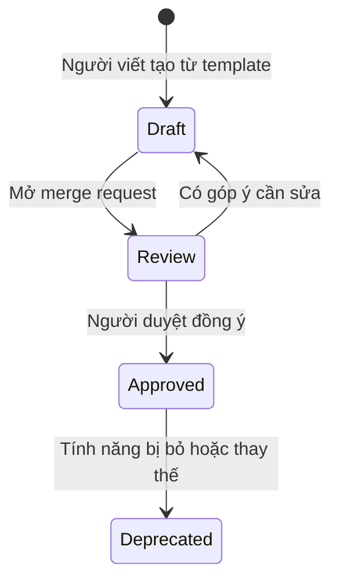

# 05 - Quy trình viết và duyệt

## 1. Vòng đời tài liệu

| Trạng thái | Ý nghĩa |
|---|---|
| `Draft` | Đang viết, chưa nên dựa vào |
| `Review` | Đã gửi duyệt |
| `Approved` | Đã duyệt, là bản đang dùng |
| `Deprecated` | Không còn dùng, ghi rõ tài liệu thay thế |

## 2. Các bước viết

1. **Lấy mã**: cấp mã tính năng trong `features/README.md`, hoặc mã `TEC`/ADR trong `techs/README.md`.
2. **Tạo thư mục** và copy template cần dùng.
3. **Điền thông tin đầu file** (mã tài liệu, trạng thái, người phụ trách, ngày cập nhật).
4. **Viết nội dung.** Cần AI hỗ trợ thì dùng prompt tương ứng trong `prompts/`, sau đó tự đọc và sửa lại. AI viết nháp, người viết chịu trách nhiệm nội dung.
5. **Vẽ sơ đồ** theo `04-diagrams.md`.
6. **Ghi tài liệu tham chiếu** theo `07-references.md`, ở cả hai phía.
7. **Tự kiểm tra** bằng checklist bên dưới.
8. **Mở merge request**, gắn người duyệt.
9. **Sửa theo góp ý**, đổi trạng thái thành `Approved` khi merge.

## 3. Checklist tự kiểm tra

- [ ] Có mã tài liệu, mã tính năng và đã cập nhật `features/README.md` (hoặc `techs/README.md` với tài liệu `TEC`, ADR).
- [ ] Để đúng chỗ: nội dung dùng chung nằm ở `techs/`, tài liệu tính năng chỉ trỏ liên kết (`06-tech-docs.md`).
- [ ] Thông tin đầu file đầy đủ.
- [ ] Mục tiêu và phạm vi nói rõ cái gì làm, cái gì không làm.
- [ ] Mọi thuật ngữ và từ viết tắt đều có giải thích.
- [ ] Mỗi luồng có các bước đánh số, có nêu điều kiện và lỗi.
- [ ] Có sơ đồ tổng quan và sequence (nếu có nhiều bên tham gia), mỗi sơ đồ đều có diễn giải.
- [ ] Ví dụ có giá trị cụ thể.
- [ ] Không còn từ trong bảng "từ nên tránh" ở `03-writing-style.md`.
- [ ] Liên kết đều mở được. Không còn chỗ `TODO`.
- [ ] File không quá dài. Nếu quá, đã tách theo `01-folder-structure.md`.
- [ ] Có mục "Tài liệu tham chiếu". Mỗi dòng `Dựa vào` đã có dòng `Được dùng bởi` tương ứng ở tài liệu kia.
- [ ] Đã tìm mã tài liệu trong `docs/`, mọi tài liệu đang trỏ tới đều có trong bảng tham chiếu.
- [ ] Đã rà các tài liệu tham chiếu và ghi kết quả vào cột "Đã rà tham chiếu" của lịch sử thay đổi.

## 4. Khi nào phải cập nhật tài liệu?

| Thay đổi | Cập nhật |
|---|---|
| Đổi luồng xử lý | Nghiệp vụ, sequence, kỹ thuật |
| Đổi API (thêm/bớt/đổi field) | Tài liệu API |
| Đổi cấu trúc bảng | Tài liệu kỹ thuật (phần dữ liệu) |
| Thêm mã lỗi | Bảng lỗi trong nghiệp vụ và API |
| Đổi cấu hình, biến môi trường | Tài liệu kỹ thuật (phần cấu hình) |
| Đổi kiến trúc chung, hạ tầng, quy ước dữ liệu, bảo mật dùng chung | Tài liệu `TEC` tương ứng trong `techs/` |
| Chọn công nghệ hoặc cách làm mới có ảnh hưởng lâu dài | Viết ADR mới trong `techs/adr/` |
| Sửa bất kỳ tài liệu nào ở trên | Rà các tài liệu trong mục "Tài liệu tham chiếu" của nó |

Cập nhật trong **cùng merge request** với code. Ghi thay đổi vào bảng "Lịch sử thay đổi" ở cuối tài liệu.

Mỗi lần cập nhật, làm theo quy trình rà ở `07-references.md` mục 4: mở bảng tham chiếu, tìm mã tài liệu trong `docs/`, rà từng tài liệu liên quan, sửa những tài liệu bị ảnh hưởng trong cùng merge request, rồi ghi kết quả vào cột "Đã rà tham chiếu".

## 5. Người duyệt kiểm tra gì?

1. Người chưa biết tính năng đọc có làm theo được không?
2. Nội dung có khớp với code đang chạy không?
3. Có bỏ sót luồng lỗi hoặc trường hợp đặc biệt không?
4. Văn phong và định dạng có theo quy chuẩn không?
5. Cột "Đã rà tham chiếu" đã điền chưa? Các tài liệu ghi "đã sửa" có nằm trong cùng merge request không?
