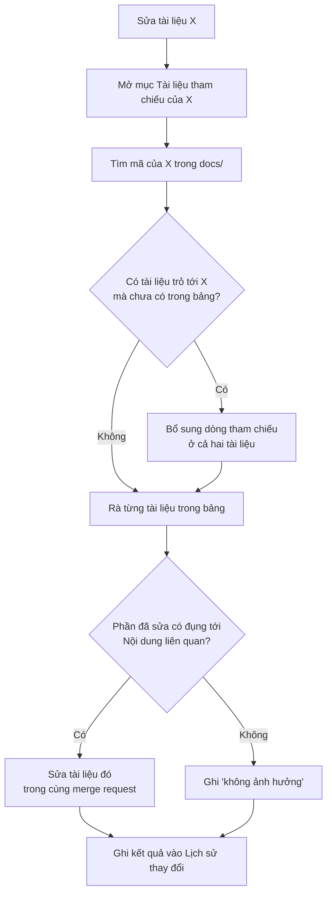

# 07 - Tài liệu tham chiếu

Tài liệu trong dự án phụ thuộc lẫn nhau. Ví dụ: tài liệu kỹ thuật của `PAY-001` dùng quy ước migration trong `TEC-003`. Nếu sửa `TEC-003` mà không rà `PAY-001`, hai tài liệu sẽ nói ngược nhau và người đọc không biết tin bên nào.

Vì vậy, mỗi tài liệu có mục **"Tài liệu tham chiếu"** để ghi nó liên quan tới tài liệu nào. Mỗi lần cập nhật, người sửa dựa vào mục này để rà các tài liệu có thể bị ảnh hưởng.

## 1. Tài liệu nào phải có mục này?

- Mọi tài liệu trong `features/` và `techs/`, kể cả ADR.
- Quy chuẩn, template và prompt không cần mục này. Tuy nhiên, khi sửa chúng vẫn phải tìm các file đang trỏ tới (xem mục 4, bước 3).

## 2. Cách viết

Mục "Tài liệu tham chiếu" đặt ngay trước "Lịch sử thay đổi", dạng bảng. Ví dụ bảng trong `features/PAY/PAY-001-qr-payment/02-technical.md`:

```markdown
| Mã | Tài liệu | Chiều | Nội dung liên quan |
|---|---|---|---|
| `TEC-003` | [Quy ước migration](../../../techs/data/TEC-003-migration-rules.md) | Dựa vào | Mục 4 Dữ liệu dùng quy tắc `TEC-003-R02` (đặt tên bảng) |
| `PAY-002` | [Hoàn tiền - Kỹ thuật](../PAY-002-refund/02-technical.md) | Được dùng bởi | PAY-002 đọc bảng `transactions` mô tả ở mục 4.1 |
| `ADR-0007` | [Dùng PostgreSQL](../../../techs/adr/ADR-0007-use-postgresql.md) | Dựa vào | Lý do chọn kiểu `jsonb` ở mục 4.1 |
```

Ý nghĩa các cột:

- **Mã**: mã tài liệu hoặc mã tính năng, để tìm kiếm được.
- **Tài liệu**: liên kết tương đối tới đúng file.
- **Chiều**:
  - `Dựa vào`: tài liệu này dùng nội dung của tài liệu kia. Tài liệu kia đổi thì tài liệu này có thể phải sửa theo.
  - `Được dùng bởi`: tài liệu kia dùng nội dung của tài liệu này. Tài liệu này đổi thì phải rà tài liệu kia.
- **Nội dung liên quan**: nói rõ mục, mã quy tắc, bảng hay API nào liên quan. Người rà nhìn cột này là biết cần kiểm tra chỗ nào, không phải đọc lại cả tài liệu.

Quy tắc ghi:

1. **Ghi cả hai chiều.** Khi tài liệu A thêm dòng `Dựa vào B`, tài liệu B phải thêm dòng `Được dùng bởi A`, trong cùng merge request. Nhờ vậy, ai sửa B cũng thấy ngay A cần rà.
2. **Không liệt kê tài liệu cùng thư mục tính năng.** Các file `00-` đến `05-` của một tính năng luôn được rà cùng nhau theo bảng ở `05-doc-workflow.md` mục 4.
3. **Chỉ ghi quan hệ thật.** Chỉ nhắc tên cho biết thì không ghi. Có dùng nội dung (quy tắc, dữ liệu, API, luồng) thì mới ghi.
4. Chưa có tài liệu liên quan thì ghi một dòng: "Chưa có."

## 3. Khi nào thêm hoặc sửa dòng tham chiếu?

| Tình huống | Việc cần làm |
|---|---|
| Tài liệu mới dùng quy tắc, dữ liệu hoặc API của tài liệu khác | Thêm `Dựa vào` ở tài liệu mới, thêm `Được dùng bởi` ở tài liệu kia |
| Bỏ phụ thuộc | Xóa dòng ở cả hai tài liệu |
| Đổi tên hoặc đường dẫn file | Sửa liên kết ở mọi tài liệu đang trỏ tới |
| Tài liệu chuyển sang `Deprecated` | Rà mọi dòng `Được dùng bởi`, chuyển các tài liệu đó sang trỏ tới tài liệu thay thế |

## 4. Quy trình rà khi cập nhật một tài liệu



**Diễn giải theo bước:**

1. Sửa xong nội dung tài liệu X.
2. Mở mục "Tài liệu tham chiếu" của X, lấy danh sách tài liệu liên quan.
3. Tìm mã của X (ví dụ `TEC-003`) trong toàn bộ `docs/` để bắt các tài liệu đang trỏ tới X nhưng chưa được ghi vào bảng. Nếu có, bổ sung dòng tham chiếu ở cả hai phía.

   ```bash
   grep -rn "TEC-003" docs/
   ```

4. Với từng tài liệu trong bảng, so phần vừa sửa với cột "Nội dung liên quan":
   - Dòng `Được dùng bởi`: tài liệu kia đang dùng nội dung của X. Nếu phần đã sửa đụng tới nội dung đó, **bắt buộc** sửa tài liệu kia.
   - Dòng `Dựa vào`: kiểm tra thay đổi của X có còn khớp với tài liệu gốc không. Nếu X cần làm khác quy tắc gốc, phải sửa tài liệu gốc hoặc viết ADR, không được tự làm khác.
5. Sửa các tài liệu bị ảnh hưởng trong **cùng merge request**. Nếu không sửa kịp (ví dụ tài liệu của nhóm khác), tạo việc cần làm trong `todo/` (mã `TSK`, xem `todo/README.md` mục 6) và ghi mã việc vào lịch sử thay đổi.
6. Ghi kết quả rà vào cột "Đã rà tham chiếu" trong bảng "Lịch sử thay đổi" của X.

> Ví dụ: sửa quy tắc đặt tên bảng `TEC-003-R02`. Bảng tham chiếu của `TEC-003` có `PAY-001` và `PAY-002` ở chiều "Được dùng bởi". `PAY-001` có bảng mới theo quy tắc cũ nên phải sửa. `PAY-002` chỉ đọc bảng, không tạo bảng, nên không ảnh hưởng. Lịch sử thay đổi của `TEC-003` ghi: `PAY-001: đã sửa; PAY-002: không ảnh hưởng`.

## 5. Ghi vào lịch sử thay đổi

Bảng "Lịch sử thay đổi" của mọi tài liệu trong `features/` và `techs/` có thêm cột "Đã rà tham chiếu":

| Ngày | Người sửa | Nội dung | Đã rà tham chiếu |
|---|---|---|---|
| 2026-09-28 | An | Đổi quy tắc `TEC-003-R02` | `PAY-001`: đã sửa; `PAY-002`: không ảnh hưởng |
| 2026-09-20 | An | Sửa lỗi chính tả | Không cần (không đổi nội dung) |

- Sửa chính tả, định dạng mà không đổi ý thì ghi "Không cần".
- Người duyệt merge request kiểm tra cột này. Để trống thì chưa được duyệt.
