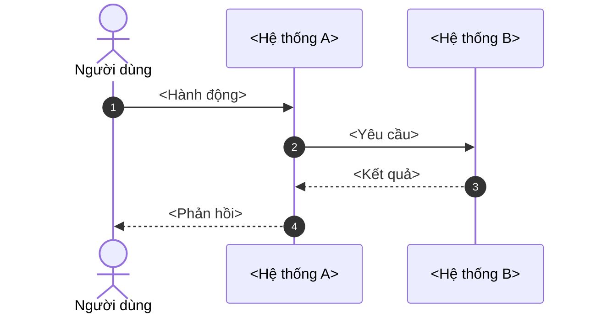

# SEQ-<MODULE>-<NNN> - <Tên tính năng> (Sequence)

## 1. Luồng chính: <Tên luồng>

**Mục đích:** <Một câu.>
**Điều kiện trước:** <...>

**Diễn giải theo bước:**

| Bước | Ai làm | Việc gì | Vì sao |
|---|---|---|---|
| 1 | <Người dùng> | <...> | <...> |
| 2 | <Hệ thống A> | <...> | <...> |

**Kết quả:** <Dữ liệu và trạng thái sau khi chạy xong.>

## 2. Luồng lỗi: <Tên luồng lỗi>

<Vẽ riêng nếu luồng lỗi phức tạp. Nếu đơn giản, dùng `alt`/`else` trong sơ đồ chính.>

## 3. Tài liệu tham chiếu

Quy tắc ghi: `standards/07-references.md`. Không liệt kê các file cùng thư mục tính năng.

| Mã | Tài liệu | Chiều | Nội dung liên quan |
|---|---|---|---|
| <TEC-001> | [<Tên>](<đường dẫn tương đối>) | <Dựa vào / Được dùng bởi> | <Mục, mã quy tắc, bảng hoặc API liên quan> |

## 4. Lịch sử thay đổi

| Ngày | Người sửa | Nội dung | Đã rà tham chiếu |
|---|---|---|---|
| <YYYY-MM-DD> | <Tên> | Tạo mới | Không cần |
