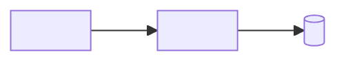

# TEC-<NNN> - <Tên chủ đề kỹ thuật>

## 1. Tóm tắt

<2-4 câu: tài liệu nói về gì, ai cần đọc, đọc xong làm được gì.>

## 2. Phạm vi áp dụng

**Áp dụng cho:**
- <Service, repo, môi trường. Ví dụ: mọi service backend viết bằng Java>

**Không áp dụng cho:**
- <...>

## 3. Bối cảnh

<Vấn đề gì dẫn tới tài liệu này? Ràng buộc nào cần tính đến? Nếu có quyết định kiến trúc liên quan, trỏ tới ADR: [ADR-<NNNN>](../adr/ADR-<NNNN>-<short-name>.md).>

## 4. Tổng quan

<Tiêu đề sơ đồ>



**Diễn giải:** <Từng thành phần làm gì, gọi nhau bằng giao thức gì.>

## 5. Quy tắc bắt buộc

| Mã | Quy tắc | Lý do |
|---|---|---|
| TEC-<NNN>-R01 | <Phải / không được ...> | <Vì sao> |
| TEC-<NNN>-R02 | <...> | <...> |

## 6. Hướng dẫn thực hiện

<Các bước cụ thể, mỗi bước bắt đầu bằng động từ.>

1. <Bước 1> (`<lệnh>`).
2. <Bước 2>.

```bash
<lệnh mẫu chạy được>
```

## 7. Cấu hình

| Tên cấu hình | Mặc định | Ý nghĩa | Ví dụ |
|---|---|---|---|
| `<name>` | <...> | <...> | `<...>` |

## 8. Kiểm tra và xử lý sự cố

| Dấu hiệu | Nguyên nhân thường gặp | Cách xử lý |
|---|---|---|
| <...> | <...> | <...> |

## 9. Câu hỏi còn mở

- [ ] <...>

## 10. Tài liệu tham chiếu

Quy tắc ghi: `standards/07-references.md`.

| Mã | Tài liệu | Chiều | Nội dung liên quan |
|---|---|---|---|
| <PAY-001> | [<Tên>](<đường dẫn tương đối>) | <Dựa vào / Được dùng bởi> | <Mục, mã quy tắc, bảng hoặc API liên quan> |

## 11. Lịch sử thay đổi

| Ngày | Người sửa | Nội dung | Đã rà tham chiếu |
|---|---|---|---|
| <YYYY-MM-DD> | <Tên> | Tạo mới | Không cần |
