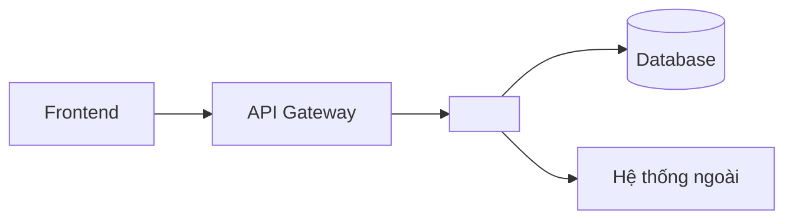
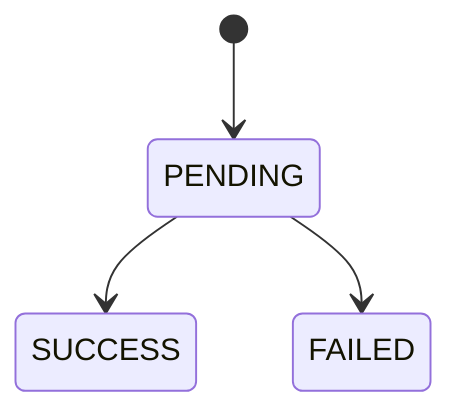

# TECH-<MODULE>-<NNN> - <Tên tính năng> (Kỹ thuật)

## 1. Tóm tắt giải pháp

<3-5 câu: làm theo cách nào và vì sao chọn cách đó. Trỏ tới ADR nếu có: [ADR-0001](...).>

> Lưu ý: phần kỹ thuật dùng chung (kiến trúc, hạ tầng, quy ước dữ liệu, bảo mật) đã có trong `techs/` thì chỉ tóm tắt một dòng và trỏ liên kết tới tài liệu `TEC`, không chép lại. Ghi tài liệu đó vào mục "Tài liệu tham chiếu".

## 2. Kiến trúc

<Tiêu đề sơ đồ>

**Diễn giải:** <Từng thành phần làm gì, gọi nhau bằng giao thức gì.>

| Thành phần | Repo / module | Trách nhiệm |
|---|---|---|
| <Service> | <repo> | <...> |

## 3. Luồng xử lý

Xem chi tiết ở [SEQ-<MODULE>-<NNN>](04-sequence.md). Tóm tắt:

1. <Bước 1 - ai gọi ai, để làm gì>
2. <Bước 2>

## 4. Dữ liệu

### 4.1. Bảng mới hoặc bảng thay đổi

| Bảng | Cột | Kiểu | Bắt buộc | Ghi chú |
|---|---|---|---|---|
| <transactions> | id | uuid | Có | Khóa chính |
| | status | varchar(20) | Có | PENDING, SUCCESS, FAILED |

### 4.2. Trạng thái

## 5. Cấu hình

| Tên cấu hình | Mặc định | Ý nghĩa | Ví dụ |
|---|---|---|---|
| `<app.payment.timeout>` | 30s | <Thời gian chờ tối đa> | `45s` |

## 6. Xử lý lỗi

| Mã lỗi | Khi nào xảy ra | Hệ thống làm gì | Thử lại? |
|---|---|---|---|
| <MODULE>-E001 | <Ngân hàng không phản hồi> | <Đánh dấu PENDING, dò lại sau> | Có, tối đa 3 lần |

## 7. Bảo mật và hiệu năng

- <Dữ liệu nhạy cảm nào cần che/mã hóa?>
- <Giới hạn số request, timeout, kích thước dữ liệu.>

## 8. Cách chạy thử và kiểm tra

1. <Lệnh khởi động> (`<lệnh>`).
2. <Gọi thử API> (`<lệnh curl>`).
3. <Kết quả mong đợi>.

## 9. Ảnh hưởng tới hệ thống khác

| Hệ thống | Ảnh hưởng | Cần làm gì |
|---|---|---|
| <...> | <...> | <...> |

## 10. Tài liệu tham chiếu

Quy tắc ghi: `standards/07-references.md`. Không liệt kê các file cùng thư mục tính năng.

| Mã | Tài liệu | Chiều | Nội dung liên quan |
|---|---|---|---|
| <TEC-003> | [<Tên>](<đường dẫn tương đối>) | <Dựa vào / Được dùng bởi> | <Mục, mã quy tắc, bảng hoặc API liên quan> |

## 11. Lịch sử thay đổi

| Ngày | Người sửa | Nội dung | Đã rà tham chiếu |
|---|---|---|---|
| <YYYY-MM-DD> | <Tên> | Tạo mới | Không cần |
