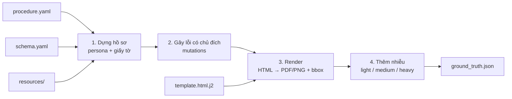

# Golden set tổng hợp

Bộ công cụ sinh hồ sơ hành chính giả có sẵn ground truth, phục vụ [AIP-026](../../docs/problems/ai-problems/AIP-026-layered-golden-set.md) và [AIP-027](../../docs/problems/ai-problems/AIP-027-end-to-end-evaluation.md). Ground truth được sinh cùng lúc với hồ sơ nên không phải gán nhãn tay.

## 1. Pipeline



**Diễn giải:**

1. Mỗi hồ sơ có một **persona** (người nộp) dùng chung cho mọi giấy tờ: họ tên, CCCD, ngày sinh, địa chỉ, thẻ đang dùng (CMND 9 số, CCCD mã vạch, CCCD gắn chip, thẻ căn cước, theo ngày cấp). Thủ tục khai báo `people: deceased_owner` thì dựng thêm nhóm người có quan hệ (người đứng tên đã mất, vợ/chồng, các con, hộ khẩu có con dâu/rể/cháu, bên bán đất, người làm chứng), dòng thời gian và thửa đất dùng chung. Trường của từng giấy tờ lấy từ đây hoặc từ generator có ràng buộc.
2. Theo tỷ lệ cấu hình trong `procedure.yaml`, hồ sơ bị gây lỗi có chủ đích: thiếu giấy tờ, sai ngày, không đủ điều kiện, mâu thuẫn giữa các giấy tờ. Nhãn quyết định và lý do ghi ngay lúc này.
3. Template Jinja2 được render bằng Playwright (Chromium) ra PDF và PNG. Mỗi trường trong template gắn `data-field`, nên lấy được bounding box, mỗi dòng chữ một box. Hình thức bản gốc (khổ thẻ/A4/sổ, giấy ố, mực phai, nếp gấp, giấy kẻ dòng, font đánh máy/viết tay) khai báo ở mục `render` của schema.
4. Ảnh sạch được thêm nhiễu theo từng mức. Biến đổi hình học (xoay, phối cảnh) do code tự làm để biến đổi bbox theo cùng ma trận. Nhiễu quang học (mờ, hạt, JPEG, bóng) dùng Augraphy, chỉ các phép không đổi kích thước ảnh.

## 2. Thủ tục có sẵn

`giai-toa-den-bu`: hồ sơ bồi thường, hỗ trợ khi Nhà nước thu hồi đất, bộ giấy tờ ở [AIP-027 mục 4.2](../../docs/problems/ai-problems/AIP-027-end-to-end-evaluation.md). Tình huống: người đứng tên nhà đất đã mất, một người thừa kế đại diện gia đình nộp hồ sơ. Ngoài nhãn từng giấy tờ, `ground_truth.json` có mục `compensation` (người thừa kế, nguồn gốc và thời điểm sử dụng đất, diện tích, số nhân khẩu) làm nhãn cho đánh giá cuối.

| Giấy tờ (`doc_type`) | Biến thể | Hình thức |
|---|---|---|
| `can-cuoc` | `cmnd-9`, `cccd-ma-vach`, `cccd-chip`, `the-can-cuoc` theo ngày cấp | Khổ thẻ, 2 mặt, MRZ, QR/chip/mã vạch giả lập |
| `giay-chung-tu` | `giay-chung-tu` (trước 2016, điền tay), `trich-luc-khai-tu` (in máy) | A4, giấy cũ |
| `giay-chung-nhan-nha-dat` | `danh-may`, `viet-tay` | 4 trang: chủ sở hữu; nhà, đất; sơ đồ thửa đất; biến động viết tay kèm dấu |
| `ban-ve-hien-trang` | | Bản vẽ SVG: số đo cạnh, tứ cận, bảng diện tích, khung tên |
| `to-dang-ky-nha-dat` | `danh-may` (máy chữ), `viet-tay` | Giấy rất cũ, ố, nếp gấp |
| `so-ho-khau` | `da-xoa-ten` (người mất trước 2023), `chua-xoa-ten` | Khổ sổ, mỗi nhân khẩu một trang, trang điều chỉnh viết tay |
| `giay-sang-dat` | Không có mẫu | Viết tay trên giấy kẻ dòng; bố cục và lời văn tự do (`generator/freeform.py`), trường có cấu trúc do generator quy tắc sinh |

**Mỗi hồ sơ là một tập dữ liệu:** cùng một nhóm người (người nộp, người mất, gia đình, bên bán đất), luôn đủ 7 giấy tờ, thông tin khớp nhau giữa các giấy tờ trừ chỗ cài lỗi có chủ đích. Mỗi tập nhận một **kịch bản biến thể** (mục `coverage` của `procedure.yaml`): nguồn gốc đất (trước 18/12/1980, 1980-15/10/1993, từ 15/10/1993) × thế hệ thẻ × thời kỳ người mất × giấy chứng nhận đánh máy/viết tay × tờ đăng ký đánh máy/viết tay. Kịch bản xoay vòng nên mọi biến thể xuất hiện đều nhau với bất kỳ số lượng nào, và cứ 108 tập thì phủ hết mọi tổ hợp. Tổ hợp không thể có ngoài thực tế (ví dụ người nộp 15-17 tuổi với CCCD mã vạch) được giữ đúng thực tế và ghi ở cột `unmet`. Dùng `--coverage random` để lấy phân bố tự nhiên.

`giai-toa-den-bu-tphcm`: cùng tình huống, nhà đất ở TP.HCM, thêm 5 giấy tờ của quá trình bồi thường theo Quyết định 11/2026/QĐ-UBND TP.HCM. 7 giấy tờ đầu vào dùng lại của `giai-toa-den-bu` (khóa `from`). Số tiền tính bằng `generator/thu_hoi.py`; công thức, giả định và câu hỏi còn mở ở [specs/de-xuat-giay-to-boi-thuong.md](specs/de-xuat-giay-to-boi-thuong.md).

| Giấy tờ (`doc_type`) | Biến thể | Hình thức |
|---|---|---|
| `gxn-1131` | `danh-may`, `dien-tay` | A4, UBND cấp xã xác nhận nguồn gốc, thời điểm sử dụng đất `[CẦN XÁC NHẬN]` mẫu thật |
| `bt-dat` | | A4 ngang, bảng chiết tính, tổng bằng số và bằng chữ |
| `bt-cong-trinh` | | A4 ngang, bảng 10 cột: khối lượng, đơn giá, tỷ lệ còn lại, bổ sung đủ 60% |
| `tai-dinh-cu` | `can-ho`, `nen-dat`, `tu-lo-cho-o` | Quyết định; chỉ có khi hộ đủ điều kiện tái định cư |
| `khen-thuong` | | Quyết định; chỉ có khi bàn giao mặt bằng đúng hạn |

Thêm 3 trục kịch bản: phạm vi thu hồi (toàn bộ / một phần) × bàn giao (đúng hạn / trễ) × tái định cư (căn hộ / nền đất / tự lo / không đủ điều kiện), cứ 16 tập đầu phủ hết. Ca lỗi M10-M19 kiểm tra số học (tổng cộng, bằng chữ, sàn 60%), mức thưởng, nhân khẩu, thứ tự ngày.

Địa chỉ trên giấy tờ lập trước 01/7/2025 ghi 3 cấp, từ mốc này ghi 2 cấp, cùng một nơi (AIP-008). Dấu, quốc huy, ảnh chân dung là hình giả lập, ghi rõ "MẪU GIẢ LẬP", không mô phỏng dấu hay chi tiết bảo an thật.

## 3. Cấu trúc thư mục

```text
src/data-golden-set-generator/
├── specs/                       # Hợp đồng dữ liệu: đọc trước khi thêm giấy tờ
│   ├── schema.example.yaml      # Định dạng schema của một loại giấy tờ
│   ├── procedure.example.yaml   # Định dạng cấu hình một thủ tục
│   └── ground_truth.schema.json # JSON Schema của ground_truth.json
├── templates/
│   ├── _shared/                 # CSS, layout, macro dùng chung (quốc hiệu, ô điền)
│   └── <procedure>/             # Mỗi thủ tục một thư mục
│       ├── procedure.yaml       # Giấy tờ bắt buộc, quy tắc, ca lỗi
│       └── <doc-type>/
│           ├── template.html.j2
│           └── schema.yaml      # Cũng là định nghĩa nhãn cho tầng trích xuất
├── resources/                   # Dữ liệu tham chiếu (xem resources/README.md)
├── generator/                   # Code sinh, có version (generator/__init__.py)
├── tests/                       # fixtures/example/: thủ tục ví dụ chạy được
├── generated/                   # KHÔNG commit. Kết quả sinh
│   └── <seed>/
│       ├── manifest-<procedure>.json  # Tham số chạy, version generator, số tập theo nhãn và theo biến thể
│       ├── index-<procedure>.csv      # Mỗi tập một dòng: nhãn, ca lỗi, nguồn gốc đất, diện tích, nhân khẩu, kịch bản, biến thể từng giấy tờ
│       └── <dossier-id>/
│           ├── <doc-id>.pdf
│           ├── <doc-id>_p1.png
│           ├── <doc-id>_p1_medium.jpg
│           └── ground_truth.json      # Nhãn đầy đủ của tập: người, thửa đất, từng trường + bbox, quyết định, profile
└── real/                        # KHÔNG commit. Tập kiểm tra cuối: hồ sơ thật đã ẩn danh
```

## 4. Chạy

```bash
cd src/data-golden-set-generator
python -m venv .venv && . .venv/bin/activate
pip install -e ".[render,noise]"
playwright install chromium
python -m generator list
python -m generator generate --procedure giai-toa-den-bu --seed 42 --count 20 --noise light,medium,heavy
python -m pytest
```

## 5. Quy ước

- **Tái lập được:** cùng `seed` + cùng `GENERATOR_VERSION` phải ra cùng hồ sơ. Đổi logic sinh thì tăng version. Seed của từng hồ sơ suy ra từ seed gốc và số thứ tự.
- **Trường có cấu trúc do generator quy tắc sinh.** LLM chỉ sinh văn bản tự do (lý do đề nghị, mô tả), và phải được cache theo seed để tái lập.
- **Giữ cả bản sạch lẫn bản nhiễu** để phân tích lỗi theo mức khó.
- **Chuyên viên duyệt mẫu:** mỗi `ground_truth.json` có mục `review`. Chuyên viên duyệt một phần hồ sơ mỗi thủ tục để xác nhận hình thức và ca lỗi giống thực tế.
- **Không dùng tập tổng hợp làm tập kiểm tra cuối.** Metric trên dữ liệu giả sinh từ chính mẫu đang tinh chỉnh sẽ đẹp hơn thực tế. Tập kiểm tra cuối là hồ sơ thật đã ẩn danh, để ở `real/`.

## 6. Thêm một loại giấy tờ

Ví dụ đầy đủ một thủ tục 2 giấy tờ (schema, template, procedure) nằm ở `tests/fixtures/example/`, dùng làm mẫu để copy.

1. Tạo `templates/<procedure>/<doc-type>/schema.yaml` theo `specs/schema.example.yaml`.
2. Dựng lại biểu mẫu thật thành `template.html.j2`, kế thừa `_shared/base.html.j2`. Mỗi ô điền dùng macro `field()` để có `data-field`.
3. Khai báo giấy tờ trong `procedure.yaml` của thủ tục.
4. Sinh thử 5 hồ sơ, mở PDF so với mẫu gốc, kiểm tra bbox bằng `python -m generator inspect <dossier-dir>`.

Giấy tờ nhiều mẫu theo thời kỳ, thẻ, giấy cũ, nhóm trường lặp, bố cục tự do: xem các khóa mở rộng cuối `specs/schema.example.yaml` và ví dụ ở `templates/giai-toa-den-bu/`.

Tốc độ: khoảng 1 phút mỗi hồ sơ 7 giấy tờ (khoảng 16 trang) với cả 3 mức nhiễu; phần lớn là Augraphy. Dùng `--noise ""` khi chỉ cần ảnh sạch.
